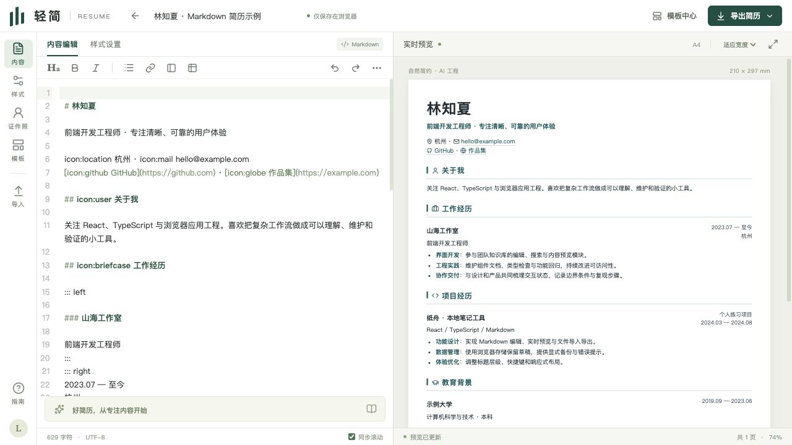
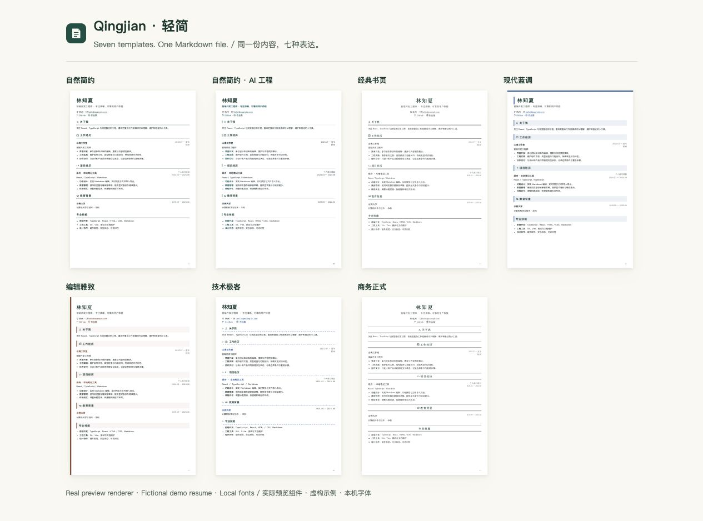

<p align="center"></p>

<h1 align="center">轻简 Qingjian</h1>
<p align="center"><strong>用 Markdown 写简历，实时预览 A4，导出 PDF。</strong></p>
<p align="center">用 AI 改 Markdown，用轻简看排版。</p>

<p align="center">
  <a href="https://okfanger.github.io/cv-creator/">在线体验</a> ·
  <a href="https://okfanger.github.io/cv-creator/about.html">项目介绍</a> ·
  <a href="docs/ai-workflow.zh-CN.md">AI 工作流</a> ·
  <a href="README.md">English</a>
</p>
<p align="center">
  <a href="https://github.com/okfanger/cv-creator/actions/workflows/ci.yml"></a>
  <a href="LICENSE"></a>
</p>



轻简是一个**本地优先的 Markdown 简历编辑器**。正文和排版配置保存在同一个文件中，支持实时 A4 预览、自动分页和浏览器打印 PDF。在线使用无需账户，也不需要部署后端。

## 为什么选择轻简

- **简历是自己的文件**：Markdown 正文、YAML 样式、照片和自定义图标可以一起保存，方便备份和自行用 Git 管理历史。
- **边写边看成品**：实时 A4 预览、自动分页，也支持手动分页和打印 PDF。
- **与外部编辑器配合**：桌面 Chrome / Edge 可连接经授权的本地文件夹；外部修改后，前台页面检查变化并更新预览，双方同时修改时提供冲突选择。
- **同一份内容，七种模板**：切换样式，调整字体、主题色、字号、行距、边距、标题、分栏与图标。
- **本地优先**：简历内容保存在浏览器或经授权连接的本地文件中，编辑器不会把正文上传到服务器。
- **给 AI 一份明确的格式说明**：外部助手可以依据[当前格式规范](llms.txt)修改文件；内容真实性和最终分页由本人复核。

## 三步开始

1. 打开[在线编辑器](https://okfanger.github.io/cv-creator/)，修改示例，或导入[示例简历](examples/developer-resume.md)。
2. 选择模板，在 A4 预览中检查文字与分页。
3. 点击“导出简历 → PDF”，在打印窗口选择“另存为 PDF”；建议关闭页眉页脚并启用背景图形。

下载完整 Markdown 作为备份。未连接本地文件的内容保存在当前浏览器，清除站点数据会清除对应草稿。当前界面为简体中文，也可导入英文简历内容。

## 用 AI 改 Markdown，用轻简看排版

在桌面 Chrome / Edge 的“我的简历”中连接专门存放简历的文件夹并授权。让外部 AI 编码助手先阅读[格式说明](llms.txt)，再修改对应文件。轻简在页面活动期间检查变化；完成后复核内容和分页，再打印 PDF。

[完整操作步骤](docs/ai-workflow.zh-CN.md) · [下载虚构演示简历](examples/developer-resume.md)

轻简负责文件编辑与预览，当前不内置 AI 模型。外部助手的数据处理规则由该工具决定；网页和助手同时修改时，需要先解决冲突。

## 模板画廊



自然简约 · 自然简约 AI 工程 · 经典书页 · 现代蓝调 · 编辑雅致 · 技术极客 · 商务正式。所有模板共用同一份 Markdown；字体使用本机字体及回退字体。

## 文档与示例

| 需要做什么                   | 入口                                                                         |
| ---------------------------- | ---------------------------------------------------------------------------- |
| 用外部 AI 修改本地简历       | [中文工作流](docs/ai-workflow.zh-CN.md) · [English](docs/ai-workflow.md)     |
| 导出 PDF、理解分页           | [打印与分页指南](docs/pdf-export.md)                                         |
| 了解浏览器、存储与冲突       | [常见问题](docs/faq.md)                                                      |
| 生成符合规范的简历文件       | [Agent 格式说明](llms.txt)                                                   |
| 使用分栏与图标               | [分栏示例](examples/three-column.md) · [图标示例](examples/heading-icons.md) |
| 查看所有操作、恢复与部署细节 | [完整操作手册](docs/editor-guide.zh-CN.md)                                   |

[公开教程页](https://okfanger.github.io/cv-creator/docs/ai-workflow.zh-CN.html)无需运行编辑器即可读取，Markdown 文档和示例也随站点发布。

## 浏览器与功能边界

- 不支持文件夹访问时，仍可编辑、导入、下载 Markdown 和打印 PDF。
- 本地目录同步需要桌面 Chrome / Edge、HTTPS 或 localhost，以及 File System Access API 和 Web Locks。后台标签页不保证固定检查间隔，关闭网页后不再同步。
- 当前没有 Service Worker，断网重新加载应用不保证可用。
- PDF 效果与浏览器打印、本机字体有关，尚未认证 ATS 兼容性。

## 本地开发

使用 **Node.js 24** 和 CI 采用的 **npm**：

```sh
git clone https://github.com/okfanger/cv-creator.git
cd cv-creator
npm ci
npm run dev
```

```sh
npm test
npm run build
npm run check:site
```

技术栈：React、TypeScript、Vite、CodeMirror、markdown-it。历史 pnpm 锁文件保留，本轮使用 npm 维护安装与 CI。

### 部署

仓库提供 [GitHub Pages 工作流](.github/workflows/deploy.yml)。在 Settings → Pages 中选择 GitHub Actions；默认路径为 `/cv-creator/`，更换路径或域名时设置 `VITE_BASE_PATH` 和 `VITE_SITE_URL` 两个 Actions 变量。[完整部署说明](docs/editor-guide.zh-CN.md#部署到-github-pages)

## 参与贡献

欢迎模板、文档、翻译和可复现的浏览器修复。先阅读[贡献指南](CONTRIBUTING.md)和[具体贡献方向](docs/contribution-opportunities.md)，大改动先通过 Issue 讨论用户问题；PR 会自动运行测试和构建检查。

如果轻简帮助了你的工作流，欢迎 Star，方便下次找到；分享实际案例、反馈问题或帮助其他使用者，也能支持项目继续完善。

## 许可证与致谢

[ISC](LICENSE)。依赖和公开格式参考见[第三方致谢](docs/credits.md)。
